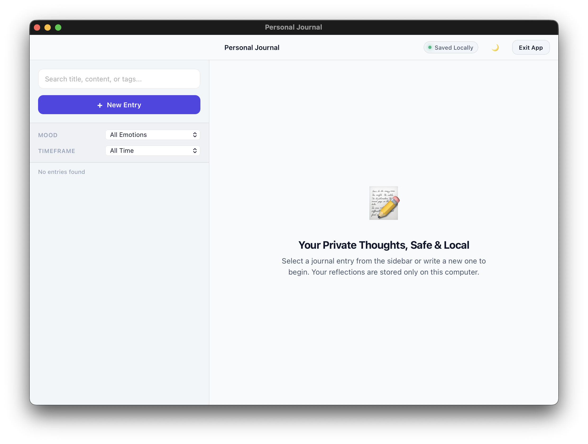
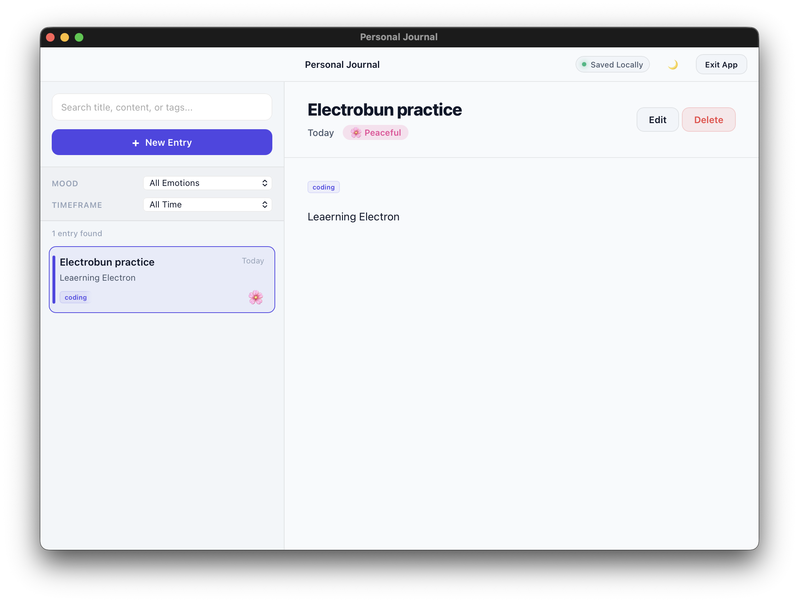
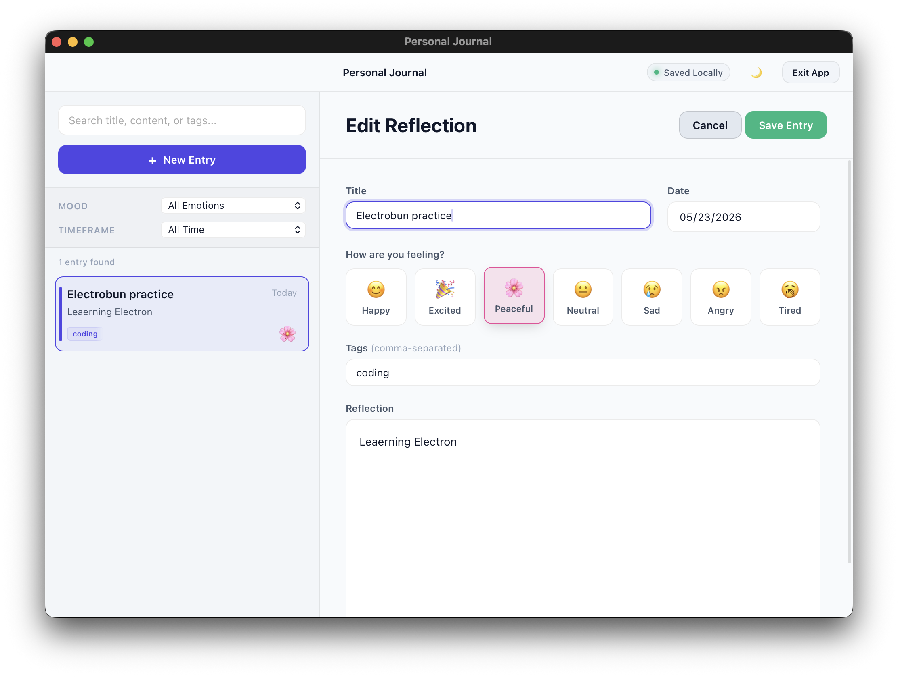

# 📝 Personal Journal

A beautiful, local-first, private desktop journal application built on the **Bun JavaScript runtime** and powered by the **Electrobun** desktop webview framework.

## 📸 Screenshots

### Empty State


### Journal Entry View


### Edit Reflection


---

## ✨ Features

### 🔒 1. Local-First & Private

Your thoughts stay strictly on your device. The application does not connect to external servers or cloud services.

- **Entries** are persisted locally in `entries.json` within your workspace directory.
- **Settings** (active theme and window dimensions) are stored locally in `settings.json`.

### 🌗 2. Dynamic Theme Toggling & Persistence

- Supports seamless switching between a clean, paper-like **Light Mode** and a focused **Dark Mode**.
- Theme selections and window dimensions are automatically persisted across application restarts.

### 🎨 3. Modern Custom UI

- **Native Feel:** Tailored specifically for macOS using native system fonts (`-apple-system`, `SF Pro`), and launched with a `hiddenInset` title bar style matching standard macOS apps.
- **Micro-animations:** Incorporates subtle hover effects on entries, scaling animations on interactive buttons, and custom caret styling.
- **Glassmorphism:** Elegant blur backdrops on the sidebar navigation and headers.

### 📝 4. Interactive Form Editor

- **Editor:** Styled writing workspace with custom text selections, carets, and wrapping.
- **Mood Selector:** One-click selector supporting 7 emotion states: Happy, Excited, Peaceful, Neutral, Sad, Angry, and Tired.
- **Tag Support:** Categorize entries using comma-separated tags that parse automatically into search badges.

### 🔍 5. Advanced Search & Filtering

- **Real-time Search:** Matches title, content, or tags instantly as you type.
- **Mood Filtering:** Quick dropdown to filter reflections by emotion.
- **Date Timeframes:** Quick presets (All Time, Today, This Week, This Month, This Year) or a **Custom Date Range** selection with two calendars.

### ⌨️ 6. Native Keyboard Shortcuts

Navigate your journal quickly from your keyboard:

- `ArrowDown` or `j` — Select the next entry in the list.
- `ArrowUp` or `k` — Select the previous entry in the list.
- `n` — Open the editor to create a new reflection.
- `e` — Edit the selected reflection.
- `/` or `s` — Place focus on the search input box.
- `Escape` — Cancel editing or clear the active search query.

---

## 📁 Folder Structure

```
personal_journal/
├── src/
│   ├── index.ts               # Main Process (Bun runtime: Window, FFI, RPC)
│   ├── shared/
│   │   └── types.ts           # Shared TypeScript schemas and RPC typings
│   └── renderer/
│       ├── index.html         # Frontend view layout
│       ├── index.css          # Core CSS stylesheet, variables, and themes
│       └── index.ts           # Frontend view scripts and Electroview client
├── electrobun.config.ts       # Electrobun compiler configurations
├── package.json               # Dependencies and runner scripts
└── tsconfig.json              # TypeScript compiler settings
```

---

## 🚀 Quick Start

### 1. Install Dependencies

Make sure you have [Bun](https://bun.sh/) installed, then run:

```bash
bun install
```

### 2. Run the App in Development Mode

To launch the desktop application, compile assets, and attach FFI/sockets:

```bash
bun run dev
```

### 3. Build & Minify for Release

To bundle, compile, and minify the main process and view files:

```bash
bun run build
```

This outputs a compiled macOS application bundle under:
`build/stable-macos-arm64/Personal Journal.app`
